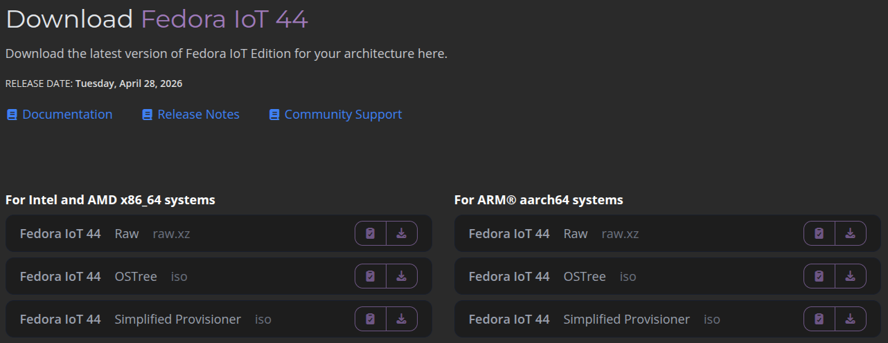
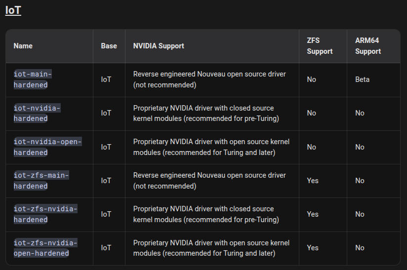

# 1) Installing Fedora IoT for Virtualization

First we need to download the Fedora IoT .iso file from their sources:
https://fedoraproject.org/iot/download/



Fedora IoT (OSTree) under the AMD x86_64 section will be our main choice.
After verifying the .iso, proceed to installation.
Fedora Media Writer is recommended for making a bootable USB.
https://docs.fedoraproject.org/en-US/fedora/latest/preparing-boot-media/

> Notes:
> 1) It's recommended to choose LUKS full disk encryption so the operating system's data is encrypted at rest.
> 2) During installation you will need to enable the root account for privileged operation capabilities, since we will need it eventually.
> 3) Installing without a WiFi or Ethernet configuration is not recommended as further steps require internet access.

# 2) Rebasing to Secureblue

Secureblue is a set of security-focused patches and hardening that can either be applied to base Fedora images or installed as a standalone desktop operating system.
For our installation, the instructions advise to rebase from Fedora IoT to Secureblue's images.



``iot-main-hardened`` is the correct one assuming you're not running on nvidia hardware.

Rebase by running:

```
$ sudo bootc switch ghcr.io/secureblue/iot-main-hardened:latest
```

Once rebased to Secureblue, run ``ujust dns-selector`` to acquire a global encrypted DNS configuration.
```
$ ujust dns-selector

What DNS settings would you like to modify?
Press Ctrl+C to exit the script at any stage.
1. Reset to defaults.
   Uses the Unbound resolver with DNSSEC disabled.
2. Configure DNS over HTTPS in Trivalent.
   Masks your DNS queries as regular HTTPS requests when web browsing.
3. Configure DNSSEC.
   Toggle local validation, to allow/block spoofed responses.
4. Configure global DNS.
   Enforce secure DNS for all connections, including VPNs.
5. Change the resolver.
   Switch from Unbound (usually more reliable, supports DNSSEC) to
   systemd-resolved for better compatibility with some VPNs.
Choose an option [1-5]: 4

Select a DNS provider:
1. Control D: has content filtering, anycast
2. Cloudflare: very fast with some data collection, anycast
3. Choose custom DNS resolvers
Choose an option [1-3]: 2

Select server profile for Cloudflare:
1. No filtering
2. Security: Block Malware
3. Family: Block Malware + Adult Content
Choose an option [1-3]: 2

Would you like to enable local DNSSEC validation?
1. Enable:  Validate your chosen server's responses for all signed domains.
   Uses the Internet's "root trust anchors" for zero-trust lookups.
2. Disable: Trust your chosen nameserver to validate DNSSEC for you.
   Our suggested servers validate DNSSEC, but custom providers may not.
Choose an option [1-2]: 1

Would you like to enable DNS over HTTPS (DoH) in the Trivalent browser?
1. Enable:  Send Trivalent's DNS queries to your chosen HTTPS endpoint.
2. Disable: Use the same encrypted DNS as the rest of the system.
Choose an option [1-2]: 1 (not running a browser, no effect)
```

After installing, its good to check the Supply-chain Levels for Software Artifacts (SLSA) provenance so you know your operating system image is not tampered with. 
``ujust update-system``, an update script bundled with Secureblue among other convenient setup scripts, can do SLSA verification.

If SLSA verification passes, continue.
If not, it's recommended to reinstall the system starting from step 1 as it could indicate corruption or a compromised system.

# 3) Installing Cockpit
To enable cockpit, you can simply follow the instructions at https://cockpit-project.org/running.html#coreos

Since our system is using rpm-ostree instead of dnf, we will need to install cockpit's rpm packages.
```
$ rpm-ostree install cockpit-system cockpit-machines cockpit-podman cockpit-ostree cockpit-networkmanager cockpit-files
```
After installing, the system requires a reboot.

Before enabling cockpit and starting it in podman, we need to enable ssh password authentication.

Since this is Secureblue and not regular Fedora IoT, sudo has been uninstalled in favor of run0, a more secure version.
```
$ echo 'PasswordAuthentication yes' | run0 tee /etc/ssh/sshd_config.d/02-enable-passwords.conf
$ run0 systemctl try-restart sshd
```

Before running the next command, podman needs to trust the podman image being offered, otherwise it will fail to install.
```
$ podman image trust set -t accept quay.io/cockpit/ws
```

Now running the command works (run as root):
```
$ run0 podman container runlabel --name cockpit-ws RUN quay.io/cockpit/ws
```

Then we can make it start on boot:
```
$ podman container runlabel INSTALL quay.io/cockpit/ws
$ systemctl enable cockpit.service
$ systemctl start cockpit.service
```

After it starts, you may not be able to access cockpit at first due to firewalld blocking the connection. Simply run:
```
$ firewall-cmd --add-service=cockpit --permanent
$ firewall-cmd --reload
$ firewall-cmd --list-services
```

If you want to connect using a hostname instead of the system's current internal IP address (192.168.x.x), using the avahi-daemon is not recommended.
This is because mDNS is insecure by design, allowing any and all devices on the current network to announce any name or service. 

It's recommended to give the system a static IP address on its local area network.
Another option is adding your own DNS on the network the host is running on.
